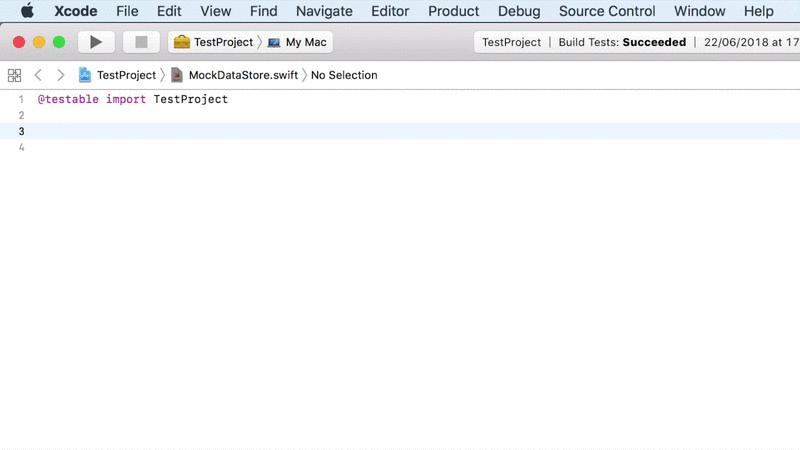

# Swift Mock Generator Xcode Source Editor Extension


An Xcode extension (plugin) to generate spy, stub, and dummy classes automatically.



[Looking for the AppCode version?](https://github.com/seanhenry/MockGenerator)

## Install Swift Mock Generator Xcode Source Editor Extension

- Download the latest release [here](https://github.com/seanhenry/SwiftMockGeneratorForXcode/releases)
- Copy the app to the `Applications` folder.
- Open the app
- Go to `System Preferences -> Extensions -> Xcode Source Editor` and make sure `Mock Generator` is enabled.
- Open Xcode

## How to create a new Swift mock

- Create an empty mock class conforming to a protocol.

Example:
```
class MySpy: MyProtocol {
}
```
- Place the cursor inside the class declaration.
- Click `Editor -> Mock Generator -> Generate spy`.

## How to recreate a Swift mock

If you change the underlying protocol its mock will need to be regenerated.

To regenerate the mock, simply follow the steps above.

## Recommended: assign a shortcut

- Select preferences `⌘,` in Xcode.
- Choose 'Key Bindings'.
- Search for 'Mock Generator'.
- Choose your preferred shortcut.

## Recommended: use a version control system

The mock generator will replace anything that is currently in your class with the generated test double.

Undo is supported for Xcode plugins but you're safer to use a version control system such as `git` in the event of unexpectedly generating a test double.

## Features

| Feature | Supported |
|---|---|
| Swift 3 and 4.|✅|
| Generate and regenerate a spy.|✅|
| Generate and regenerate a stub.|✅|
| Generate and regenerate a dummy.|✅|
| **Classes and protocols** |
| Generates test doubles conforming to one or many protocols.|✅|
| Generates test doubles conforming to a class.||
| Generates test doubles conforming to both classes and protocols.||
| **Recording methods and properties** |
| Captures invocation status of methods.|✅|
| Captures invocation status of properties.|✅|
| Records multiple invocations of methods.|✅|
| Records multiple invocations of properties.|✅|
| Captures invoked method parameters.|✅|
| Records multiple invocations of method parameters.|✅|
| Supports multiple properties in the same declaration.||
| **Stubbing return values and closures** |
| Stubs values for your test doubles to return.|✅|
| Stubs a default value for return values where possible.|✅|
| Automatically calls closure parameters with stubbed values.|✅|
| **Initializers** |
| Generates convenience initializers requiring no parameters.||
| Supports initializers with arguments.|✅|
| Supports failable initializers.|✅|
| Supports required initializers.||
| **Throws** |
| Stub an error for your overridden method to throw. |✅|
| Supports throwing initializers. |✅|
| Supports throwing closures. |✅|
| **Generics** |
| Generates generic test doubles from protocols with associated types.||
| Captures invoked generic parameters. |✅ \*|
| Captures invoked generic return values. |✅ \*|
| **Scope, keywords, and more** |
| Avoids naming clashes from overloaded methods.|✅|
| Supports parameter type-annotation attributes and `inout`.|✅|
| Respects the test double scope and generates `public` and `open` methods and properties.||
| Generate test doubles inheriting from items in 3rd party frameworks.||

\* generic arguments in closures and generic types are not supported

## Feature requests

If there is a feature you need, check for an existing GitHub issue and make a comment or, if no issue exists, raise a new issue.

## Usage example

A protocol called Animator that we wish to spy on:

```
protocol Animator {
  func animate(duration: TimeInterval, animations: () -> (), completion: (Bool) -> ()) -> Bool
}
```
Create a spy class conforming to a protocol:
```
class AnimatorSpy: Animator {
}
```
Generate the spy:

```
class AnimatorSpy: Animator {

  var invokedAnimate = false
  var invokedAnimateCount = 0
  var invokedAnimateParameters: (duration: TimeInterval, Void)?
  var invokedAnimateParametersList = [(duration: TimeInterval, Void)]()
  var shouldInvokeAnimateAnimations = false
  var stubbedAnimateCompletionResult: (Bool, Void)?
  var stubbedAnimateResult: Bool! = false

  func animate(duration: TimeInterval, animations: () -> (), completion: (Bool) -> ()) -> Bool {
    invokedAnimate = true
    invokedAnimateCount += 1
    invokedAnimateParameters = (duration, ())
    invokedAnimateParametersList.append((duration, ()))
    if shouldInvokeAnimateAnimations {
      animations()
    }
    if let result = stubbedAnimateCompletionResult {
      completion(result.0)
    }
    return stubbedAnimateResult
  }
}
```
Inject the spy into the class you wish to test:

```
let animatorSpy = AnimatorSpy()
let object = ObjectToTest(animator: animatorSpy)
```
Test if animate method was invoked:

```
func test_spyCanVerifyInvokedMethod() {
  object.myMethod()
  XCTAssertTrue(animatorSpy.invokedAnimate)
}
```
Test the correct parameter was passed to the animate method:

```
func test_spyCanVerifyInvokedParameters() {
  object.myMethod()
  XCTAssertEqual(animatorSpy.invokedAnimateParameters?.duration, 5)
}
```
Test the number of times animate was invoked:

```
func test_spyCanVerifyInvokedMethodCount() {
  object.myMethod()
  object.myMethod()
  XCTAssertEqual(animatorSpy.invokedAnimateCount, 2)
}
```
Test the parameters passed into each call of the animate method:

```
func test_spyCanVerifyMultipleInvokedMethodParameters() {
  object.myMethod()
  object.myMethod()
  XCTAssertEqual(animatorSpy.invokedAnimateParametersList[0].duration, 5)
  XCTAssertEqual(animatorSpy.invokedAnimateParametersList[1].duration, 5)
}
```
Stub a return value for the animate method:

```
func test_spyCanReturnAStubbedValue() {
  animatorSpy.stubbedAnimateResult = true
  let result = object.myMethod()
  XCTAssertTrue(result)
}
```
Stub the value for the completion closure in the animate method:

```
func test_spyCanCallClosure_withStubbedValue() {
  animatorSpy.stubbedAnimateCompletionResult = (false, ())
  object.myMethod()
  XCTAssertFalse(object.animationDidComplete)
}
```

## Disable or remove the plugin

To disable:

Go to `System Preferences -> Extensions` and deselect the extension under `Xcode Source Editor`.

To remove:

Delete the app.

## Nomenclature

Despite being called a Mock Generator, this plugin actually generates a spy, stub or dummy. The word 'mock', whilst not technically correct, has been used because test doubles such as spies, mocks, and stubs have become commonly known as mocks.

## Build

To bootstrap the project's dependencies use:
```
make
```

# Credits

Many thanks to the contributors of [SourceKitten](https://github.com/jpsim/SourceKitten) for making such an easy-to-use wrapper around SourceKit.

Many thanks to the contributors of [swift-ast](https://github.com/yanagiba/swift-ast) for a great lexer which has made writing a parser much easier.

Many thanks to the contributors of [kotlin-native](https://github.com/JetBrains/kotlin-native) for a Kotlin LLVM backend which enables code sharing between the Xcode and AppCode plugins.

Many thanks to the contributors of [GRMustache](https://github.com/groue/GRMustache) for a enabling great Mustache test double templates.

And special thanks to everyone who is contributing by raising issues and feature requests.

This tool wouldn't exist without you all!
